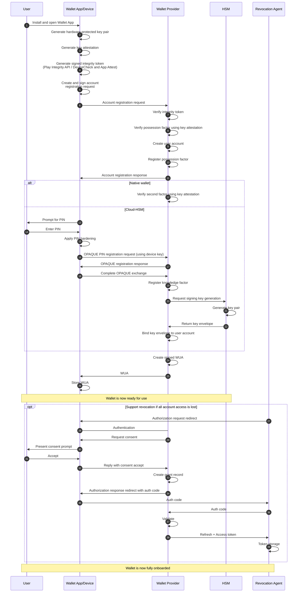

# Wallet Onboarding Flow

**Status**: Draft

**Executive summary**: This document describes the onboarding flow for the digital identity wallet, which uses two-factor authentication: a hardware-backed device key (possession) and a PIN (knowledge). The Wallet Provider verifies both and links them to an HSM key. User identification and PID issuance are handled separately by the PID Provider. The flow supports critical functions (e.g., revocation) even if all devices are lost.

## Problem Statement and Desired Outcome

A digital identity wallet must establish two-factor authentication to support high-assurance operations. The possession factor is a hardware-protected device key, with attestation confirming it is stored in tamper-resistant hardware. The knowledge factor is a user-chosen PIN, registered via an augmented PAKE protocol (OPAQUE).

The Wallet Provider requires a user account to enable certain wallet functionality. Crucially, the Wallet Provider verifies both authentication factors, and then generates a distinct HSM-protected signing key for that wallet device.

The result is a registered wallet instance with an HSM-protected signing key associated with both authentication factors and a Wallet Unit Attestation (WUA) that can be presented to attestation issuers. A user account may be linked to multiple wallet devices (account creating and management are out of scope).

The onboarding flow supports a range of privacy-preserving wallet features, including [revocation if all of a user's registered devices are lost](https://github.com/diggsweden/wallet-expert-group/blob/main/docs/revocation/revocation.md).

## Success Criteria

Onboarding is successful when the following criteria are met:

1. The possession factor is registered with the Wallet Provider.
2. The knowledge factor is registered with the Wallet Provider.
3. An HSM-protected signing key is generated and stored in the user's wallet account.
4. An WUA containing the HSM-protected signing key is issued to the device.
5. The device is ready to obtain a PID.
6. Revocation mechanisms are established that do not depend on user access to the wallet account.

> Note 1: The WUA provides cryptographic proof to the PID Provider that the PoP key (i.e., the HSM-protected key) is protected by two-factor authentication verified by the Wallet Provider, establishing the Level of Assurance required for PID issuance.

> Note 2: The Wallet Provider verifies both authentication factors and attests to their validity. The PID Provider identifies the user and associates this identification with the HSM-protected PoP key.

> Note 3: The revocation mechanism established during onboarding complements other mechanisms available when the user retains access to their wallet account (not detailed herein).

## Design Decision, Drivers, and Requirements

The following decision drivers apply:

* The Wallet Provider MUST NOT learn the user’s real-world identity during onboarding or wallet operations, even if this necessitates additional steps or responsibilities.
* For LoA High, the wallet MUST establish two independent authentication factors: possession (hardware-protected device key) and knowledge (PIN).
* Device keys MUST be hardware-backed with verifiable proof of tamper-resistant storage.
* To limit breach impact and protect privacy, registration MUST prevent the Wallet Provider from learning the PIN and attackers from accessing any usable user data.
* PIN registration MUST occur over a secure session initiated with the device key to bind possession and knowledge factors.
* Users MUST NOT be required to remember or store any information beyond their PIN for onboarding or subsequent wallet operations.
* The solution MUST support multiple devices per user, with each device having independent possession and knowledge factors and distinct HSM-protected signing keys.

> Note: Previously, we considered supporting multiple devices per wallet instance. However, this requires a cloud-based wallet and adds complexity. A simpler, architecture-agnostic approach is to allow only one device per wallet instance. The PID Provider may impose additional limits on how many instances receive a PID.

## Scope and Related Documentation

This document describes the **initial wallet onboarding flow** for a user's first device. The following scenarios are excluded from this document and will be covered separately:

* **Adding Additional Devices**: Authorizing a new device when a user already has a registered wallet.

* **Revocation Scenarios**: Methods for revoking wallet instances when all devices are lost, stolen, or compromised, and the user cannot access their wallet account.

* **Wallet Recovery**: Mechanisms for recovering wallet access after device loss.

* **Attestation (Re-)Issuance**: Obtaining attestations beyond the initial issuance of the WUA.

## Onboarding Flow

This section outlines the wallet onboarding process from the device perspective, with a sequence diagram followed by step-by-step descriptions.

### Overview

Onboarding consists of the following steps (happy path):

1. The user installs the Wallet App and opens it for the first time.
2. Device generates a hardware-protected key pair and obtains a key attestation.
3. The device registers with the Wallet Provider, which triggers account creation (out of scope).
4. The Wallet Provider issues a WUA after completing the following:
    * Cloud wallet: The device registers a PIN with the Wallet Provider over a secure session initiated using the device key (cf. OPAQUE). The Wallet Provider then generates an HSM-protected signing key and links it to the user account.
    * Mobile wallet: The Wallet Provider accepts the device key as the hardware-protected signing key, based on a key attestation confirming the required security level and user authentication(cf. [StrongBox](https://source.android.com/docs/security/features/keystore/attestation) and [Secure Enclave](https://developer.apple.com/documentation/security/protecting-keys-with-the-secure-enclave) for details).
5. The Wallet Provider issues a WUA containing the hardware-protected signing key. The wallet device is now ready to request a PID.

### Sequence Diagram

The following sequence diagram illustrates the complete onboarding flow with a focus on a cloud-wallet (happy path). The diagram shows also the required delegation of the revocation authorization.

### Steps 1-4: Wallet App Install and Initiation

The user downloads and installs the Wallet App on their wallet device, then launches it to begin initialization.

**User Action:**
- Complete Wallet App initialization steps (details out of scope).

**Device Action:**
- Generates a hardware-protected asymmetric key pair.
- Generates an associated key attestation.
- Generate integrity token (platform specific) 

> Note: The specifics of key attestation and the intended use of the device key depend on the certification state of the user's device. A non-certified device requires a cloud wallet, where the device key functions as a context key for authenticated communication with the cloud wallet operator.

### Steps 5-11: Account Creation and Device Registration

The device initiates device account registration with the Wallet Provider, submits the required information, and receives a registration completion notification.

**Device Action:**
- Device prepares and submits an account registration request to the Wallet Provider containing:
  - Device integrity assurances from Step 4.
  - Device key attestation from Step 3.

**Wallet Provider Actions:**
- Verifies integrity token.
- Verifies key attestation.
- Creates user account.
- Registers the possession factor.
- Confirms account registration.

### Steps 12-26: Second Factor Check and WUA Issuance

Following device registration, the Wallet Provider has two options. 

If key attestation and integrity checks originate from a certified EUDIW device, the Wallet Provider can verify second-factor control using the key attestation alone (Step 12). In this case, in Step 2, the device has already gated access to the signing key behind a second factor.

If not, Steps 13–23 cover prompting the user for a PIN, registering it server-side using OPAQUE, generating the user's HSM-protected signing key, and exporting and associating the key envelope with the user account.

In either case, once the Wallet Provider has confirmed two-factor control and obtained assurance of a hardware-protected key, it creates and signs a WUA, which it then issues to the Wallet App. The user can then request, for example, a PID.

### Steps 27-39: Delegated Revocation Authority with OAuth 2.0

To support revocation when a user loses access to their wallet account, a privacy-preserving fallback is required. Normally, users manage devices and recovery via their wallet account, but loss of access necessitates an alternative.

The solution delegates revocation authority to a Revocation Agent during initial onboarding. Once a WUA is issued, the wallet visits a Revocation Agent and initiates with the delegation setup. Later, the user can authenticate to the Revocation Agent, who exchanges their refresh token for an access token. The access token is then submitted to the Wallet Provider's revocation endpoint to complete the revocation.

This approach also covers cases where the Wallet Provider revokes the WUA and must notify the user via a channel other than the wallet device (per TS3 and HLR requirements). The Wallet Provider can reference the delegation token and forward the revocation notice to the designated Revocation Agent.

For details on the delegated revocation, see [revocation.md](https://github.com/diggsweden/wallet-expert-group/blob/main/docs/revocation/revocation.md)