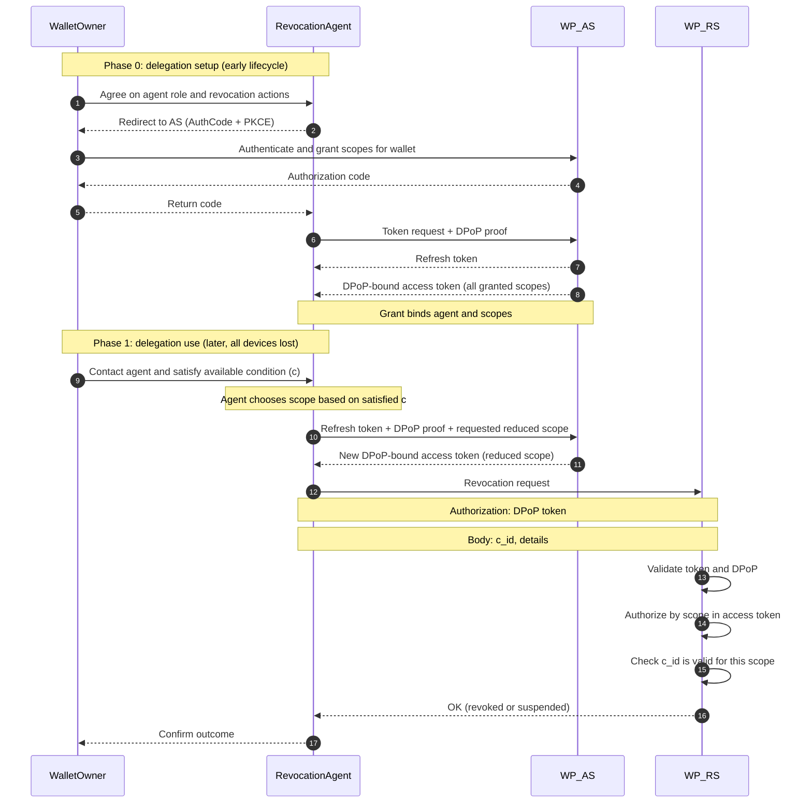

# Revocation When All Devices Are Lost

**Status**: Ready for internal review

**Executive summary**: This text introduces two revocation approaches that enable a user to revoke their wallet instance(s). These approaches do not require the wallet provider to learn the user's identity or the user to retain control of any existing wallet device or authentication device. The first method uses pseudonymous authentication. The second (recommended method), delegates revocation authority.

## Problem Statement and Desired Outcome

A user may lose access to all wallet devices. If an attacker gains control of one and bypasses local authentication, they can impersonate the user or misuse attestations. Therefore, users must be able to disable wallet functionality without access to any existing wallet device or account.

For privacy, the entity observing wallet usage (e.g., via HSM access) should not know the user's identity. Centralizing identity and usage data creates a high-value target: if breached alongside a sensitive service (e.g., age verification for adult content), an attacker could link users to sensitive activity and exploit that for extortion. Separating identity and usage across entities limits the impact of such breaches.

Users may also wish to disable wallet functionality either temporarily (suspension) or permanently (revocation). Accordingly, revocation mechanisms must prevent unauthorized use, preserve user anonymity, and support varying assurance levels for reversible and irreversible actions.

> This text focuses solely on the revocation trigger. Details of the revocation process (such as whether a revoked wallet enters a suspension period to prevent unauthorized use) are out of scope.

This document defines success criteria and decision drivers, and uses them to develop two revocation approaches that function when all devices are lost.

## Success Criteria

Success is defined as disabling the Wallet Instance, either temporarily (suspension) or permanently (revocation). In the case of permanent revocation, two things occur:

1. No new WUAs are issued, preventing an attacker from obtaining new attestations where issuance depends on a valid WUA.
2. If necessary, existing WUAs are revoked. The associated wallet identifier is added to a public revocation list. This serves as a notification mechanism, enabling issuers to take appropriate action if they have issued attestations to that identifier. This also prevents attackers from using still-valid attestations contained within the compromised wallet.
3. Revocation is made with the consent of the legitimate wallet owner in a way that honors the wallet owner's prioritization between the risk of unauthorized revocation and the risk of failing to revoke a compromised wallet instance.

Issuers are not prescribed a specific method for revocation or revalidation; each MUST adopt mechanisms aligned with their threat model and privacy requirements.

## Decision Drivers

The following decision drivers apply:

* The solution MUST NOT enable any party involved in revocation to correlate a user's real-world identity with wallet usage, even if achieving this requires new roles or novel mechanisms.
* Revocation requests MUST be explicitly authorized, scoped, and verifiable.
* Reversible actions, such as temporary suspension, MUST be executable at a lower level of assurance to enable a timely response to device loss even if initiated under uncertainty.
* Irreversible actions, such as permanent revocation, MUST require a substantial level of assurance and demonstrable authorization.
* The solution MUST be adaptable to user preferences, enabling options aligned with priorities such as misuse prevention and revocation accessibility.

The following sections describe two complementary approaches for enabling users who have lost all devices to request revocation of existing wallet instances. The first approach relies on a pseudonym seed issued by the PID provider and can be used if the user enrolls a new PID after device loss.

The second approach delegates revocation authority through a revocation token, allowing revocation without requiring PID re-enrollment. Two implementation options are proposed.

## Revocation Approach 1: Pseudonymous Revocation

The pseudonym-based revocation approach allows a user to authenticate using a pseudonym to request revocation. A pseudonym manager is required to issue the pseudonym. Ideally, this is the PID Provider, who can embed a pseudonym seed or disclosable pseudonyms in the PID.

This method is useful when a user has lost all previous devices but has acquired a new one and enrolled a new PID, without explicitly revoking the old devices. It complements other revocation mechanisms.

### Pseudonymous Authentication

The approach requires pseudonymous authentication. Instead of authenticating with an existing wallet device, the user is authorized to perform revocation by disclosing a pseudonym derived from a valid PID. This requires two elements:

1. A deterministic pseudonym; ideally managed by the PID Provider, who can embed a pseudonym seed or disclosable pseudonyms in the PID.
2. The user must obtain a new PID.

> Although seed generation is out of scope for this document, a simple method is to apply a keyed mapping function (e.g., HMAC) to existing PID data. A high-entropy random source is required to ensure the seed is not guessable.

Revocation is triggered when the user enrolls a new wallet without demonstrating linkage to an existing one. During enrollment, the PID provider authenticates the user and includes the pseudonym seed in the PID. The wallet presents this seed to the wallet provider, which detects an existing account with the same seed. The user is then asked whether they still have access to any of the previous devices. If so, they must prove control of one device to add the new one to their existing wallet account. If not, the existing devices are revoked, and the new device becomes the sole active instance.

> If the user has control of at least one device, they do not need the revocation approach detailed herein.

## Revocation Approach 2: Delegated Revocation

A delegation-based revocation approach allows a user to appoint a revocation agent to act on its behalf. The method is particularly useful when users lose access to all their devices and has not enrolled a new PID. It is intended to complement other revocation mechanisms.

Two options are presented, sharing the following commonalities:

1. Both are modeled as delegated revocation authority.
2. Both separate revocation into two phases. A delegation setup is performed while the user has access to their wallet device and account, and delegation use is invoked after the user has lost access to both.
3. Both allow the user to choose whether to prioritize misuse prevention or revocation accessibility.

The next sections first explain the main idea behind delegating revocation authority. This is followed by a brief introduction to the two revocation phases. Finally, two implementation options are discussed.

### Delegated Revocation Authority

The delegated revocation approach models revocation authorization as a delegated authority, $(x, r, c)$, where $x$ identifies a specific wallet instance, $r$ defines the rights and $c$ defines the conditions that must be met to exercise the rights. Rights are typically the right to do reversible suspension or irreversible revocation of $x$ and the condition $c$ defines conditions such as the level of wallet holder authentication and consent that is required at the time of revocation to perform an authorized action. This authority is explicitly delegated by the wallet user through a signed authorization artifact.

The artifact binds revocation rights to a designated revocation agent by including the agent’s public key as an attribute. Possession of the corresponding private key proves control over the delegated revocation authority.

Revocation requires both a proof of the delegation, and a proof of key possession. Authorization is derived from explicit delegation rather than from authentication of the requester as the wallet holder.

While the wallet holder is not authenticated to the Wallet Provider at revocation time, they must authenticate to the revocation agent to trigger execution of the delegated authority. This authentication uses any method supported by the agent that is consistent with the agreed conditions, $c$, and may therefore occur at a lower assurance level than the initial delegation. The WP does not rely on this authentication step; authorization is based solely on the delegation and proof of key control, but the agent must attest that the relevant condition(s) has been met for the requested revocation action. In practice this could mean that it can be agreed that the condition for temporary blockage is met by a simple telephone call with only basic account verification checks, while permanent revocation requires stronger authentication means.

The following sections detail the token used to delegate revocation authority and the two tokens included in enabling a delegated revocation request.

### Delegation Setup and Delegation Use

This approach follows a similar model to escrowed revocation certificates in OpenPGP [escrowed revocation certificates](https://www.ietf.org/archive/id/draft-dkg-openpgp-revocation-00.html#name-escrowed-revocation-certifi), by splitting revocation into two distinct phases. In the delegation setup phase, the user (while still in control of their wallet instance) explicitly delegates revocation authority to a designated agent. This high-assurance process results in the creation of a delegation token (Implementation Option 1) or a grant at the Authorization Server (Implementation Option 2).

In the subsequent delegation use phase, the revocation agent operates independently to submit revocation requests to the WP's revocation endpoint using a sender-constrained access token. The assurance level required for this phase can be configured by the user, depending on whether they prioritize misuse prevention or availability in emergency situations.

Next, the two implementation options are presented.

### Implementation Option 1: Delegation + Revocation Tokens

This option uses two tokens to establish a chain of delegated authority: a delegation token that conveys revocation rights from the user to a revocation agent, and a revocation token that exercises those rights. These tokens are submitted to a REST API that the WP exposes for this purpose.

#### Delegation Token

The delegation token is a user-signed authorization artifact that conveys delegated authority to revoke a specific wallet.

It is implemented as a JWS, created by the wallet while the user still retains control.

**JWS Header**

```json
{
  "alg": "ES256",
  "typ": "delegation+jwt",
  "jwk": "<wallet public key>"
}
```

The JWS Header contains information to validate the type of the token and the JWS payload. Note that the Wallet Provider is assumed to know the mapping between a wallet identifier and the wallet public key in the `jwk`.

**JWS Payload**

```json
{
  "wid": "<wallet identifier as contained in the WUA>",
  "r": ["revocation", "suspension", ...],
  "cnf": {"<revocation agent public key>"},
  "iat": 1516239022,
  "exp": 1526239022
}
```

The JWS payload contains information about the wallet identifier, `wid`, the delegated rights, `r`, and the revocation agent public key in `cnf`. It also contains explicit issuance and validity dates.

#### Revocation Token

The revocation token is signed by the revocation agent and allows the Wallet Provider to derive the revocation authorization from a delegation.

**JWS Header**

```json
{
  "alg": "ES256",
  "typ": "wallet-revocation+jwt",
  "jwk": "<revocation agent cnf key>"
}
```

The JWS Header contains information to validate the type of the token and the JWS payload. Note that the Wallet Provider needs to check that the `jwk` matches the delegation in the payload.

**JWS Payload**

```json
{

  "act": "revocation",
  "wid": "<wallet identifier as contained in the WUA>",
  "dt": {"<delegation token>"},  
  "iat": 1516239022,
  "exp": 1526239022
}
```

The JWS payload conveys both the intended action (act) and the wallet identifier (wid). It also embeds the delegation token under the `dt` attribute, allowing the Wallet Provider to derive the authorization right for the specified action.

### Implementation Option 2: OAuth 2.0

This option uses OAuth 2.0 to delegate revocation authority from a user to a revocation agent. The revocation agent is authorized to obtain sender-constrained access tokens, which it can later present to a revocation endpoint exposed by the Wallet Provider (WP).

#### Delegation Setup

During a period in which the user has control over their device and user account, the user may delegate revocation authority to a revocation agent. Each revocation agent is registered with the WP’s Authorization Server (AS) and is assigned a unique `client_id`. The agent authenticates to the AS using a registered public key (e.g., via `private_key_jwt`).


Delegation is established using a standard OAuth 2.0 Authorization Code flow with PKCE. The user explicitly authorizes the revocation agent to perform revocation-related operations on a specific wallet instance under defined conditions. This authorization is recorded as a grant at the AS and is bound to:
- the revocation agent (client),
- the permitted operations (scopes),
- the identified wallet instance (resource), and
- the conditions that must be met for each operation (as agreed with the user)

As long as this grant remains valid, the revocation agent may use an associated refresh token to obtain sender-constrained access tokens. Sender constraint is achieved using DPoP, binding issued tokens to a proof-of-possession key controlled by the revocation agent instance.

The Delegation Setup has the following steps:

1. **User initiates delegation**  
   The user visits the revocation agent.

2. **Authorization request**  
   The revocation agent redirects the user to the WP’s Authorization Server with an authorization request that:
   - uses the Authorization Code grant,
   - includes PKCE parameters,
   - requests revocation-related scope(s),
   - identifies the wallet instance as the target resource, and
   - identifies the conditions required to exercise each scope.

   ```http
   GET https://wp.example.com/authorize?
       response_type=code&
       client_id=revocation_agent_123&
       scope=wallet.revoke+wallet.suspend&
       revocation_conditions=wallet.revoke.permanent:c_high, wallet.block.temporary:c_low&
       resource=https://wp.example.com/revoke&
       redirect_uri=https://revocation-agent.example.com/callback&
       code_challenge=...&
       code_challenge_method=S256&
       state=<random_state>
    ```

3. **User authentication**  
   The user authenticates to the Authorization Server.

4. **Consent**  
   The Authorization Server presents a consent screen describing the delegated revocation rights and the affected wallet instance.

5. **Authorization grant**  
   The user approves the delegation. This results in a grant record authorizing the revocation agent for the specified wallet instance.

6. **Authorization response**  
   The Authorization Server redirects the user back to the revocation agent with an authorization code.

   ```http
   GET https://revocation-agent.example.com/callback?
       code=<authorization_code>&
       state=<same_state>
   ```

7. **Token exchange**  
   The revocation agent exchanges the authorization code for tokens at the token endpoint.
   The request is form-encoded, authenticates the client, and includes the DPoP proof.

   ```http
   POST /token
   Content-Type: application/x-www-form-urlencoded
   DPoP: <DPoP_JWT_signed_with_instance_key>

   grant_type=authorization_code&
   code=AUTH_CODE_xyz123&
   redirect_uri=https://revocation-agent.example.com/callback&
   client_id=revocation_agent_123&
   code_verifier=...&
   client_assertion_type=urn:ietf:params:oauth:client-assertion-type:jwt-bearer&
   client_assertion=<signed_JWT>
   ```

8. **Refresh token storage**  
   The revocation agent stores the refresh token securely for future use. Subsequent access tokens obtained via the refresh token are also DPoP-bound. The user can revoke delegation via the WP’s consent management UI/API, which invalidates the grant and revokes all associated refresh tokens.

#### Delegation Usage (WIP pending update)

When exercising the delegated revocation authority, the revocation agent authenticates the user in a manner that meets the set conditions for the requested action, and:

1. Obtains a DPoP-bound access token from the AS using its refresh token, requesting only the scope that will be requested (revocation action).

```http
POST https://wp.example.com/token
Content-Type: application/x-www-form-urlencoded
DPoP: <DPoP_JWT_signed_with_instance_key>

grant_type=refresh_token&
refresh_token=REFRESH_TOKEN_abc123&
client_id=revocation_agent_123&
scope=wallet.revoke.permanent&
client_assertion_type=urn:ietf:params:oauth:client-assertion-type:jwt-bearer&
client_assertion=<signed_client_assertion_JWT>
```

2. Calls the WP’s revocation endpoint, presenting the access token, a corresponding DPoP proof, and the conditions that have been met.

```http
POST https://wp.example.com/wallets/wallet_identifier_123/revoke
Authorization: DPoP ACCESS_TOKEN_xyz456
DPoP: <DPoP_JWT_signed_with_same_instance_key>
Content-Type: application/json

{
  "reason": "device_loss"
  "conditions": ["c_high"]
}
```

> Note that the access token will include the wallet id, e.g., `wid`, as a custom claim.

#### Sequence diagram



Notes on the sequence diagram:

Revocation actions are represented by defined scopes. Typical scopes are:

-  Revoke wallet permanently
-  Temporary blocking of wallet

During setup, the revocation agent is granted the scopes this agent is allowed to exercise. The user grants these scopes to the agent under set conditions. Each condition is represented by an identifier c_id. Conditions could look like:

- Condition 1 - User has called in and answered a number of control questions
- Condition 2 - User has authenticated using a national eID

In the initial setup, conditions are assigned to scopes either by explicit agreement or by implicit policies accepted by the user.

At revocation time, the user contacts the agent and requests revocation. By doing so, it meets at least one of the defined conditions.

The revocation agent selects the scope = revocation action that is consistent with the condition and requests a new access token bound to the scope that is consistent with the satisfied condition.

When requesting the revocation, the agent uses the DPoP access token bound to the requested scope and attests to what condition that was satisfied.

The resource server handling revocation then checks the claimed condition and that it is consistent with the defined action/scope. If conditions are met, revocation is performed on the wallet associated with the access token.

The agent attests condition for audit purposes. If the agent claims a condition that was not satisfied, it can be held accountable.

**PoP key and refresh token management**

The time between initial authorization of the agent and a revocation request may be long, up to several years. This diverts from the typical usage of relatively short-lived refresh tokens. We can see several strategies to handle this issue:

- Implement long-lived refresh tokens that are valid for the full duration the delegation is valid
- Enforce that revocation agents renew their refresh tokens periodically

The advantage with the second option here is that this enforces that delegations are up to date and allows the agent to rotate PoP keys on each refresh.

**Revocation of delegation**

A key advantage with this setup is that the user can revoke the delegation to authorize an agent to revoke a wallet under agreed conditions at any time. When this is done, the AS will deny further exchange of refresh tokens to new tokens. This is also an argument for implementing a periodic refresh of refresh tokens, as this also serves as a notification to the agent that the authorization to revoke the associated wallet is revoked.

**Discovery of available revocation agents**

We assume that revocation agents and wallet providers will act under local agreement, and that client registration is out of scope for this design. A viable option for the local trust setup is, however, to use OpenID federation for trust configuration and to authorize entities to act as revocation agents using trust-marks. Such a setup would also allow wallet holders to discover available revocation agents by using existing enpoint API:s of OpenID federation to list all entities that have been authorized to act in this role.


# Appendix - Delegated Revocation and Three Revocation Scenarios

This section covers three revocation scenarios. The first is user-initiated, where the user actively authenticates to the Revocation Agent and triggers a revocation request, as previously described.

The second scenario occurs when the user does not explicitly revoke the wallet device but instead onboards a new one, possibly unaware that revocation is required. In such cases, if a delegation token exists, the Revocation Agent can detect it, prompt the user, and proceed based on whether the user still controls other devices.

The third scenario involves revocation initiated by the Wallet Provider. Although not legally required at the time of writing, TS3 and HLR specify that the user must be notified through a channel other than the wallet device. If the user still has access to their wallet account, the notification can be delivered there. If access is lost, the delegation token, uploaded by the wallet to the user's account, allows the Wallet Provider to inform the designated Revocation Agent, who can then notify the user.